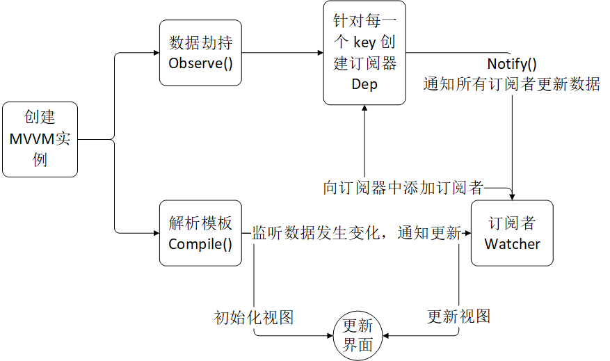

# myMVVM

## 一、数据劫持

Vue 使用 `Object.defineProperty()` 来劫持各个属性的 `setter` 和 `getter`。

具体介绍：https://developer.mozilla.org/zh-CN/docs/Web/JavaScript/Reference/Global_Objects/Object/defineProperty

## 二、初始化流程

1. 创建 `MVVM` 实例。
2. 对 `data` 属性进行数据劫持，并创建订阅器 `Dep`。
3. 解析模板中被 {{}} 包裹的内容，并初始化模板内容。
4. 在初始化的同时，创建订阅者 `Watcher`，订阅者把自定添加到当前监听数据的订阅器中。
5. 在界面上数据发生变化的同时，调用 `notify()` 函数，通知当前订阅器中已经添加的所有订阅者更新数据。

## 三、流程图：

### 具体的注释在文档中有写。